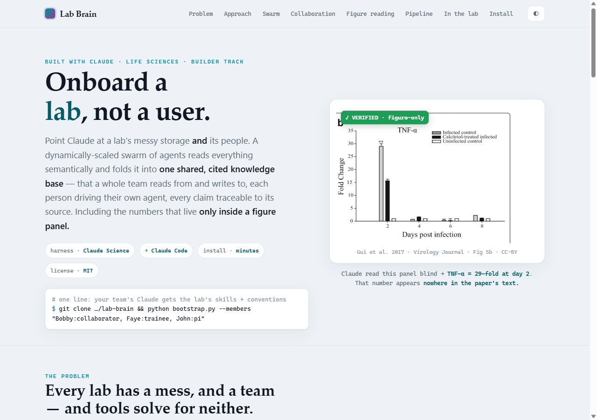
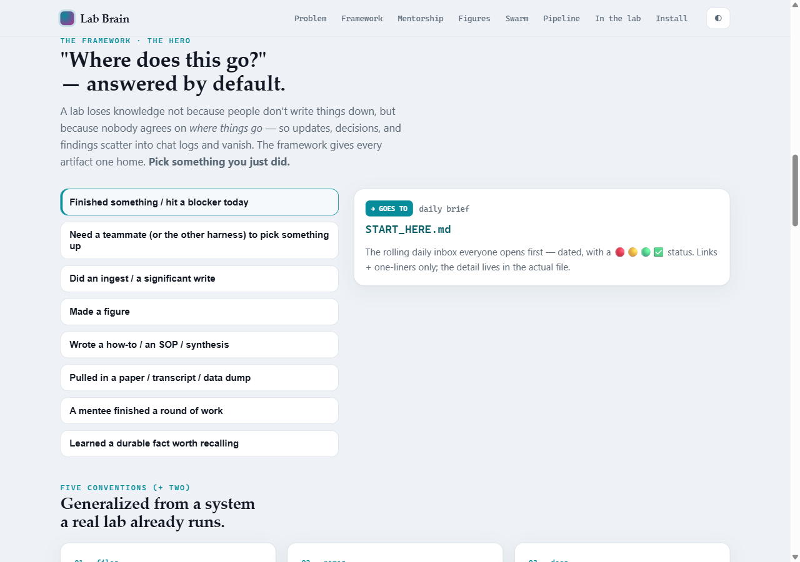
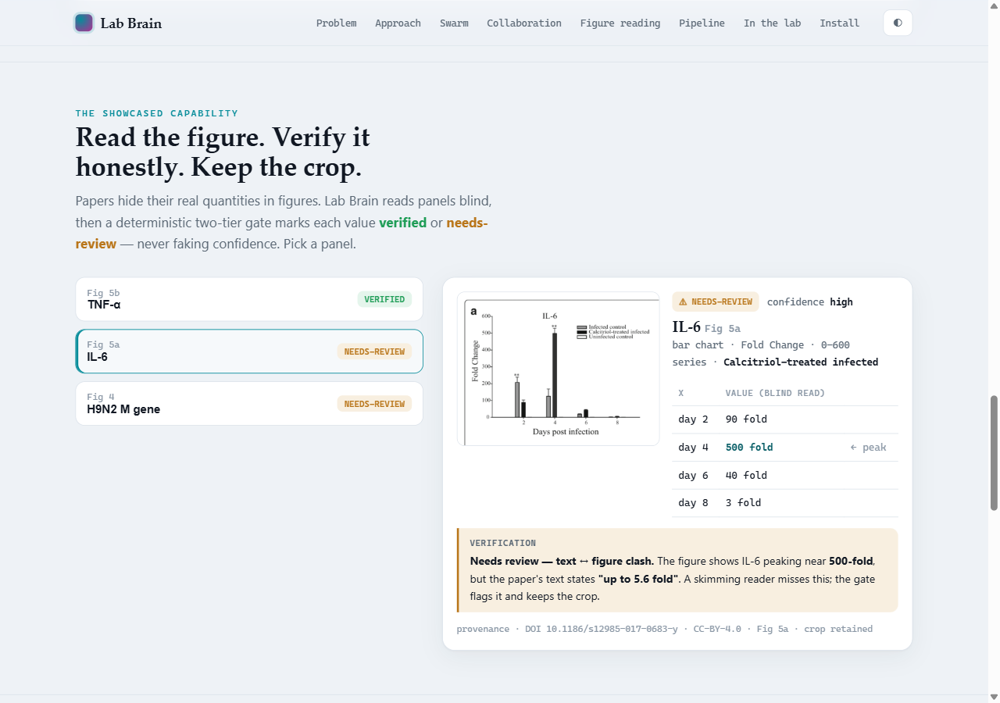

# 🧠 Lab Brain

**A proven framework for how a whole lab runs a shared knowledge base — where to document, how to
save, how to hand off, how to make figures and build the storyline, and how mentees collaborate and
report to mentors — packaged so any lab can adopt it on Claude Code + Claude Science.**

> Built for **Built with Claude: Life Sciences** (Builder track). Lab Brain isn't a chatbot over your
> files — it's the **conventions + accessory tools** that let a whole team (peers *and* undergrads)
> contribute to **one shared, cited knowledge base** without stepping on each other. Every claim is
> traceable to its source, including the numbers that live only inside a figure panel.

[](https://github.com/bobbyni819/lab-brain/actions/workflows/ci.yml)
[](./LICENSE)
· Claude Code + Claude Science · Python 3.12 · 29 tests, hermetic



> The image above is a still from **[`docs/showcase.html`](./docs/showcase.html)** — a self-contained
> interactive walkthrough (open in any browser: drag the swarm slider, flip the peers/mentee toggle,
> click the figure panels).

---

## Why this exists

Every lab loses knowledge for the same reason: **not because people don't write things down, but
because nobody agrees on WHERE things go.** Updates, decisions, handoffs, figures, and findings
scatter across chats, folders, and heads — and a new member takes months to learn what the lab
already knows. "Chat with my files" tools onboard a *user*; they can't onboard a *lab*.

Lab Brain is **not aspirational.** It's a generalization of the system a real lab **already runs in
production** — a multi-person spatial-omics project (CODEX proteomics × MALDI-IMS lipidomics, human
testis) and a Data+ undergraduate team, coordinated across Claude Code and Claude Science. We lifted
the practice out and made it installable.

## ⭐ The framework (the heart of this) — see [`framework/`](./framework/README.md)

Five conventions that turn "a pile of files and a group of people" into one self-maintaining brain:

| # | Convention | Answers |
|---|---|---|
| 1 | **[Knowledge-base structure](./framework/knowledge-base-structure.md)** | where does each *file* live? (Sources / Wiki / Output + the filing rule) |
| 2 | **[Naming & note format](./framework/naming-and-note-format.md)** | what do I *name* it, and what's the note template? |
| 3 | **[Documentation & handoffs](./framework/documentation-and-handoffs.md)** | where does each *update / decision / handoff / finding* go? (the routing map) |
| 4 | **[Figures & findings](./framework/figures-and-findings.md)** | how are figures made, verified, saved, and their insights logged? |
| 5 | **[Storyline & manuscript](./framework/storyline-and-manuscript.md)** | how is the narrative built and tracked as figures land? |
| + | **[Mentorship & collaboration](./framework/mentorship-and-collaboration.md)** | how do peers and mentees contribute, and how do mentees report up to mentors? |
| + | **[Harness playbook](./framework/harness-playbook.md)** | how do Claude Science + Claude Code share one brain without corruption? |

The single most useful thing it gives a lab is a **default answer to "where does this go?"** — so
nothing lands in a chat log and evaporates (finished-today → `START_HERE.md`; a handoff →
`_handoff-log.md`; a figure's insight → `FIGURE_FINDINGS.md`; a mentee's round → paired
`-update.md` + `-feedback.md`; a durable fact → a `MEMORY.md` note). The full table is in
[`framework/README.md`](./framework/README.md).



**See it lived-in:** [`examples/demo-lab-vault/`](./examples/demo-lab-vault/README.md) — a small,
realistic populated vault (a lab onboarding a mentee onto a flu-cytokine sub-track) showing every
convention *in use*: a daily-brief `START_HERE`, a coordination log, a supervision-gated onboarding
scaffold + filled Unknowns Register, a paired check-in round, and a `FIGURE_FINDINGS` log — all
grounded in the real Gui 2017 paper.

## Quickstart — installs in minutes

```bash
git clone https://github.com/<you>/lab-brain && cd lab-brain
python bootstrap.py --members "Bobby:mentor, Alex:mentee, John:pi"
```
That copies the lab's skills into your `.claude/`, writes a `lab-profile.yaml` to edit, and seeds the
shared framework structure (`START_HERE.md`, `_Log.md`, `_handoff-log.md`, `LANES.md`, a per-person
`progress-<person>.md`). Then, in Claude Code:

```
# onboarding pipeline
/lab-init /lab-scan /lab-index /lab-link /lab-ask "..."      # configure → inventory → read → assemble → query
# the framework, operationalized
/lab-standup      # neutral per-person updates + a team rollup (the digest half)
/lab-feedback     # capture a mentor's check-in feedback (the structured half)
/lab-figure       # make/restyle a figure the house way, then verify it by looking
/lab-findings     # log what each figure shows into FIGURE_FINDINGS.md
/lab-storyline    # build the manuscript narrative — messages first, figures follow
/lab-read-figure  # pull verified values out of figure panels    /lab-report  # a visual run report
```

> Two steps ship as **runnable, tested code** (no LLM required): `python -m labbrain.lab_scan --root
> <dir>` (a deterministic manifest + `SCAN_REPORT.md` of any messy folder) and `python -m
> labbrain.slice --paper gui2017 --provider fixture` (the figure read). The rest orchestrate agents
> through the skills, which apply the framework conventions.

## A capability that rides on the framework: reading what the text never says

Papers hide their real quantities in figures. Lab Brain reads panels blind and verifies each value —
honestly. On a real open-access paper
([Gui et al. 2017, *Virology Journal*](https://doi.org/10.1186/s12985-017-0683-y), CC-BY):



| Panel | Extracted (blind) | In the paper text? | Verdict |
|---|---|---|---|
| Fig 5b TNF-α | **29-fold @ day 2** | ❌ never stated | ✅ **VERIFIED** |
| Fig 5a IL-6 | ~500-fold @ day 4 | text says *"5.6 fold"* | ⚠️ **NEEDS-REVIEW** (text↔figure clash) |
| Fig 4 M-gene | grouped bars, broken axis | — | ⚠️ **NEEDS-REVIEW** (broken-axis flag) |

The verified numbers **exist only in the figures.** The tool never fakes confidence: a busy panel, a
broken axis, or a text↔figure disagreement is flagged `needs-review` with the panel crop always kept
as provenance. Run it yourself:

```bash
pip install -e .
python -m labbrain.slice --paper gui2017 --provider fixture \
       --vault demo_vault --report examples/gui2017/figure_report.html
```
`--provider fixture` runs fully offline. Under **Claude Science** use `--provider hostllm`; with an
API key, `--provider anthropic`. Advanced multi-panel auto-segmentation + supplementary-info reading
are Claude-Science-lane roadmap.

## How it adapts to any lab (design principle)
Genericity lives in **one file** — `lab-profile.yaml`. The framework docs, skills, and code ship with
grounded defaults and never change per-lab; another lab just edits the profile (storage, naming,
**roster + roles**, vocabulary, privacy). No abstract templates.

## Repo layout
```
lab-brain/
├── bootstrap.py              # the one-line installer (clone → setup)
├── lab-profile.example.yaml  # the ENTIRE per-lab customization layer (+ roster/roles)
├── framework/                # ⭐ THE FRAMEWORK — the conventions (the hero)
│   ├── README.md             #   overview + the "where does this go?" routing map
│   ├── knowledge-base-structure.md · naming-and-note-format.md · documentation-and-handoffs.md
│   ├── figures-and-findings.md · storyline-and-manuscript.md · mentorship-and-collaboration.md
│   ├── harness-playbook.md   #   Claude Science + Claude Code on one shared KB
│   └── templates/            #   START_HERE · _Log · _handoff-log · LANES · progress · note · FIGURE_FINDINGS · storyline · feedback · update · day-log
├── .claude/skills/           # 15 skills that apply the framework (lab-init, lab-onboard, lab-standup, lab-feedback, lab-figure, …)
├── src/labbrain/             # runnable code: lab_scan (structural) + the figure reader (fetch→…→verify→vault→report)
├── examples/gui2017/         # the verified hero-paper run
├── demo_vault/               # a stripped demo KB that fills as you run
└── tests/                    # offline pytest (29 tests: scan, verification, vault, schema, end-to-end)
```

## Design docs
- **[`framework/README.md`](./framework/README.md)** — start here: the conventions + the routing map.
- **[`docs/architecture.md`](./docs/architecture.md)** — the three layers, the swarm, verification.
- **[`SUBMISSION.md`](./SUBMISSION.md)** — the 100–200-word summary + how it maps to the rubric.

## License
MIT — see [LICENSE](./LICENSE). Uses only open-access, appropriately-licensed paper data.
