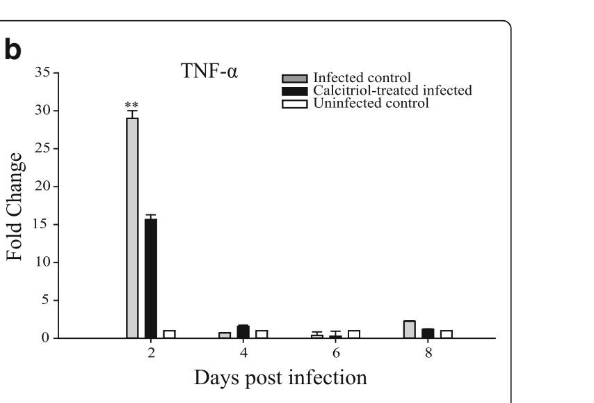

# Fig5b: Infected control

Infected control peaks at 29 fold at day 2.

## Extracted values

| Days post infection | Fold Change | Unit |
|---|---:|---|
| day 2 | 29 | fold |
| day 4 | 0.7 | fold |
| day 6 | 0.5 | fold |
| day 8 | 2 | fold |

## Verification

**VERIFIED**

- Peak lies within the axis bounds (including 2% slack).
- No comparable fold or percentage value was stated for TNF-a.
- All deterministic verification checks passed.

## Audit crop

