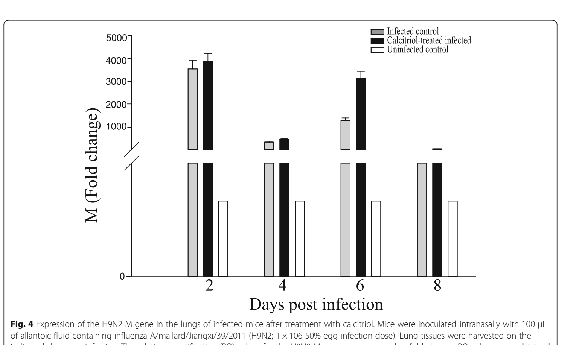

# Fig4: Calcitriol-treated infected

Calcitriol-treated infected peaks at 3900 fold at day 2.

## Extracted values

| Days post infection | M (Fold change) | Unit |
|---|---:|---|
| day 2 | 3900 | fold |
| day 4 | 800 | fold |
| day 6 | 3100 | fold |
| day 8 | 700 | fold |

## Verification

**NEEDS-REVIEW**

- Peak lies within the axis bounds (including 2% slack).
- No comparable fold or percentage value was stated for M gene.
- Hard review flag present: broken_axis.

## Audit crop

