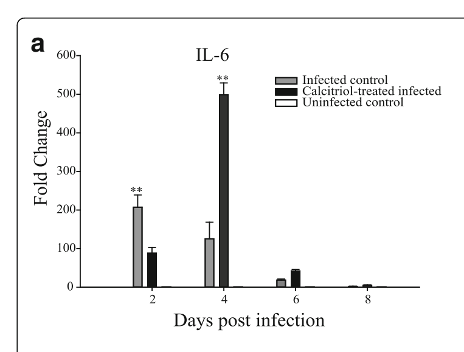

# Fig5a: Calcitriol-treated infected

Calcitriol-treated infected peaks at 500 fold at day 4.

## Extracted values

| Days post infection | Fold Change | Unit |
|---|---:|---|
| day 2 | 90 | fold |
| day 4 | 500 | fold |
| day 6 | 40 | fold |
| day 8 | 3 | fold |

## Verification

**NEEDS-REVIEW**

- Peak lies within the axis bounds (including 2% slack).
- Figure peak 500 and text value 5.6 differ by 89.29x.

## Text vs figure

> **Needs review:** Figure peak 500 conflicts with text value 5.6; text evidence: the levels of IL-6 were upregulated up to 5.6 fold in calcitriol-treated infected mice at 4 days post-infection

## Audit crop

